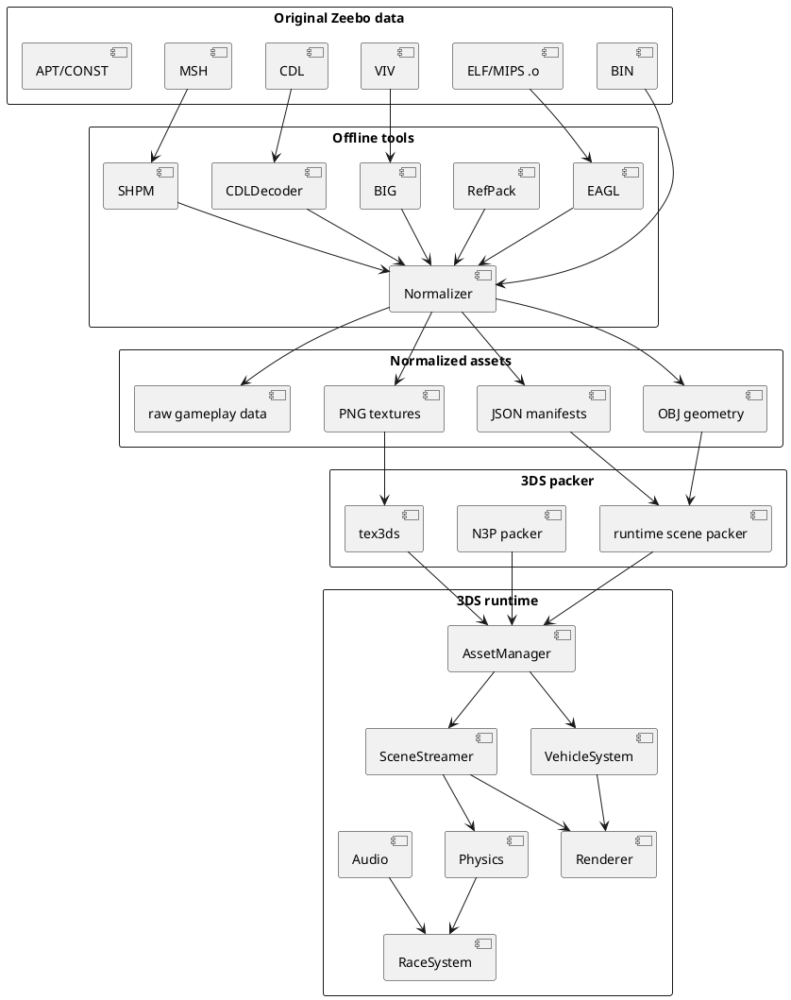

# Architecture

## Intended separation

The reverse-engineering layer and the 3DS runtime must stay separate.



## Runtime target

Target the Old Nintendo 3DS first.

Design assumptions:

- finite RAM and linear-memory budget;
- avoid loading all Palmont meshes/textures simultaneously;
- avoid runtime parsing of MIPS ELF, RefPack, SHPM or CDL;
- precompute triangle topology and material bindings offline;
- keep streamable world sections independent;
- load only selected vehicle customization parts.

## Recommended subsystem boundaries

### `AssetManager`

Owns runtime file loading and caching. It should understand only native packed
runtime assets, never original Zeebo containers.

### `SceneStreamer`

Owns Palmont section activation/deactivation based on camera/player position,
visibility data and memory budgets.

### `Renderer`

Consumes already-decoded buffers and material descriptions. Avoid embedding
archive parsing in renderer code.

### `VehicleSystem`

Owns:

- vehicle definition;
- selected body/base/hood/spoiler;
- paint colour;
- wheels;
- transforms;
- runtime material parameters.

### `RaceSystem`

Owns:

- active race ID;
- active R1 overlay;
- route/checkpoints;
- lap/progress state;
- reset/respawn.

### `Physics`

Must remain independent of visual triangle density. Derive simplified collision
or road surfaces offline where practical.

## Asset identity rule

Every generated runtime asset should retain enough identity to trace back to:

```text
archive
section/model
material ID
source hash
normalizer version
```

This is essential during reverse engineering because implementation bugs and
decoder bugs otherwise look identical.

## PocketGarage implementation (2026-09-25)

`tools/build_scene_assets.py` consumes validated normalized OBJ/MTL/PNG without
re-decoding CDL/SHPM. `scene_loader.c` is portable, bounded and tested on host.
`scene_asset.c` owns transactional GPU acquisition and a reference-counted shared
texture cache (8 MiB). `renderer.c` consumes the scene with a dedicated vertex-color
shader; vehicle N3P and lighting remain separate. Game transitions synchronize
the GPU before unloading the garage, and load a complete scene before entering.
Boot enters PocketGarage. Menu and procedural race remain available; only the
race draws the circular test world. No streaming or gameplay system was added.
See [N3S.md](N3S.md) and [hardware acceptance](POCKETGARAGE_TEST.md).

## Vehicle presentation and native frontend layer

`VehicleAsset` owns selected N3P parts, dynamic paint, recovered wheel-face
texture and bounds derived from loaded semantic parts. `Vehicle` owns animation
state (`wheel_rotation`, smoothed steering). `Renderer` owns one reusable
procedural wheel mesh and places four instances from the asset bounds. This
keeps authored wheel geometry separate from recovered asset identity.

Per-car customization state lives in `Game`: original semantic indices for
body kit, hood and spoiler, plus paint and rim choices. Loading remains
transactional; state is applied to a complete candidate vehicle before the old
asset is released. Body/base pairing continues to use the same upgrade value.

The frontend is a native state layer. Recovered PNGs provide background, Carbon
logo and customization icons; Citro2D provides native text where original APT
layout/text execution is not yet reconstructed. Debug telemetry remains on the
bottom console while presentation UI is drawn on the top screen.
