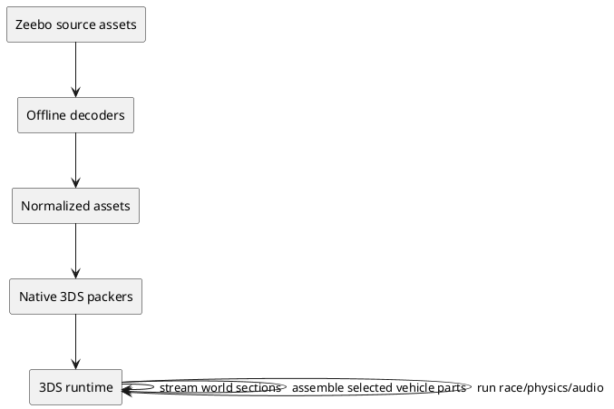

# SPEC-1-NFS-Carbon-Zeebo-to-Nintendo-3DS

## Background

The project is a native reimplementation of the Zeebo version of Need for Speed
Carbon for Nintendo 3DS. Initial experiments proved the 3DS/Citro3D runtime but
used procedural test geometry. Subsequent reverse engineering recovered original
vehicle, world, garage, race, texture and audio assets.

The current handoff deliberately separates asset reverse engineering from final
runtime implementation. Normalized assets are intended to let a coding-focused
agent continue without repeating binary archaeology.

## Requirements

### Must

- Run as Nintendo 3DS homebrew.
- Preserve source traceability for recovered assets.
- Use original recovered vehicle/world assets rather than handmade substitutes.
- Keep vehicle customization components independent.
- Stream Palmont in sections rather than load it entirely.
- Compose races from Palmont + R1 overlay + route/gameplay data.
- Keep decoding of Zeebo containers offline.
- Keep Old 3DS constraints in architecture.
- Maintain reproducible asset conversion.

### Should

- Reproduce original material behavior progressively.
- Recover wheel geometry/hubs.
- Decode route/checkpoint data.
- Recover collision/road semantics.
- Use original PocketGarage.
- Reconstruct frontend behavior from APT/CONST when core gameplay is stable.

### Could

- Add debug visualizations for all recovered structures.
- Export glTF in addition to OBJ for inspection.
- Add automated image/reference comparison.

### Won't for the first playable race

- Full career.
- All police/crew systems.
- Full APT frontend.
- Every race mode.
- Multiplayer.

## Method

Vehicle geometry is decoded from ELF/MIPS EAGL objects. Vehicle textures and
world material images are decoded from SHPM. World geometry is decoded section
by section from CDL. Race-specific R1 sections overlay the shared Palmont world.

The normalized representation uses common inspectable formats (OBJ/PNG/JSON)
and preserves source hashes/IDs. Runtime formats are allowed to evolve.

## Implementation

Suggested implementation order:

1. Define native streamable scene-section format.
2. Pack and render PocketGarage.
3. Add texture/material cache.
4. Add Palmont section streaming.
5. Add race-4001 R1 composition.
6. Decode route/checkpoint semantics.
7. Add real road/collision queries.
8. Fix vehicle selection/lifetime.
9. Recover wheels.
10. Extend to original career/frontend systems.

## Milestones

- M1: Original garage on 3DS.
- M2: Palmont streamed on 3DS.
- M3: Race 4001 route can be completed.
- M4: Vehicle customization + wheels/materials stable.
- M5: AI/opponents and race systems.
- M6: Career/frontend reconstruction.

## Gathering Results

For every milestone measure:

- visual comparison against original Zeebo behavior/reference;
- frame time and FPS on Old 3DS;
- linear-memory and texture-memory usage;
- active section/draw-call counts;
- load/unload stability;
- deterministic asset regeneration;
- absence of progressive leaks over repeated race/garage transitions.

## Need Professional Help in Developing Your Architecture?

Please contact me at [sammuti.com](https://sammuti.com) :)
